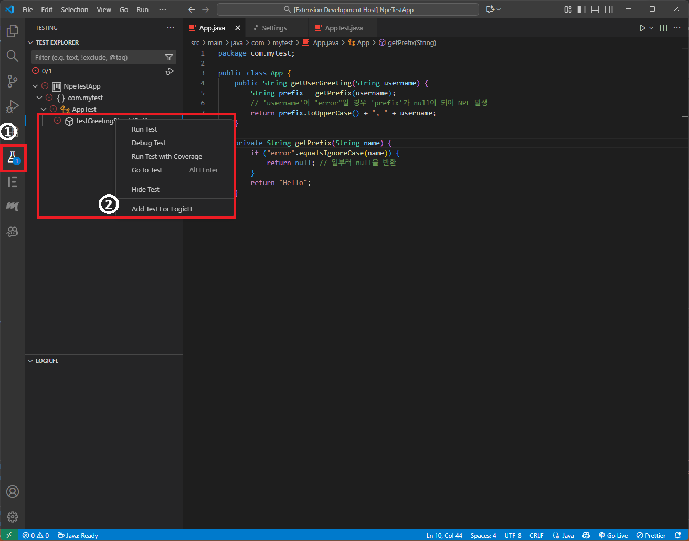
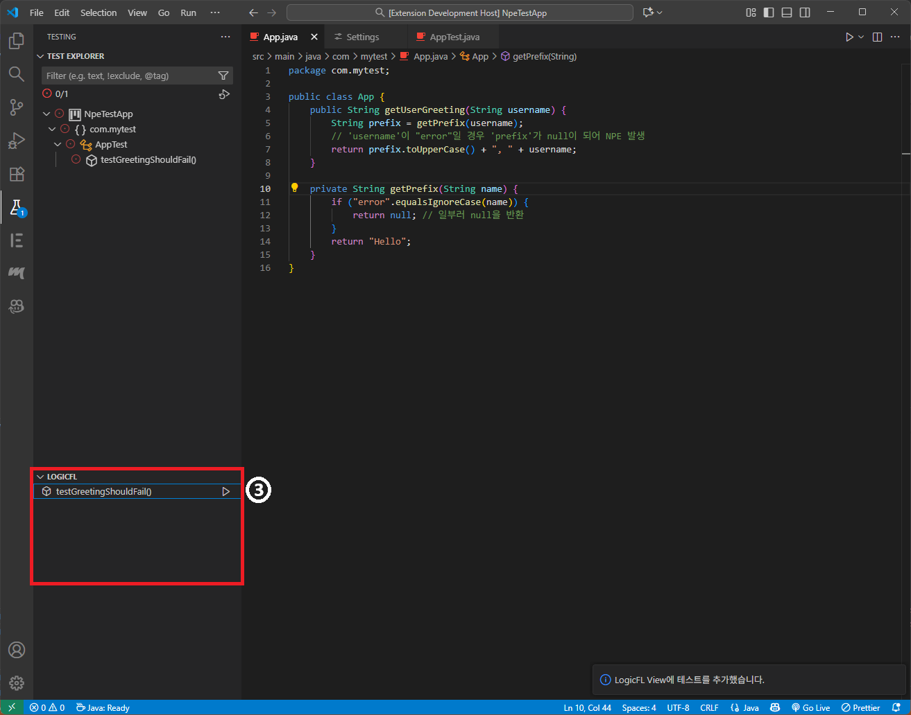
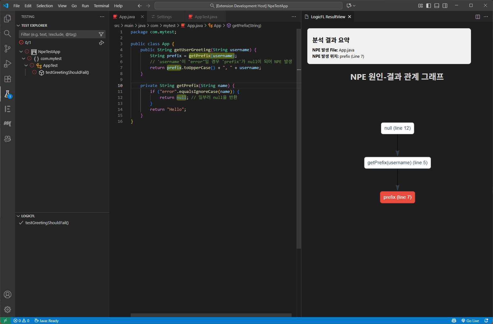
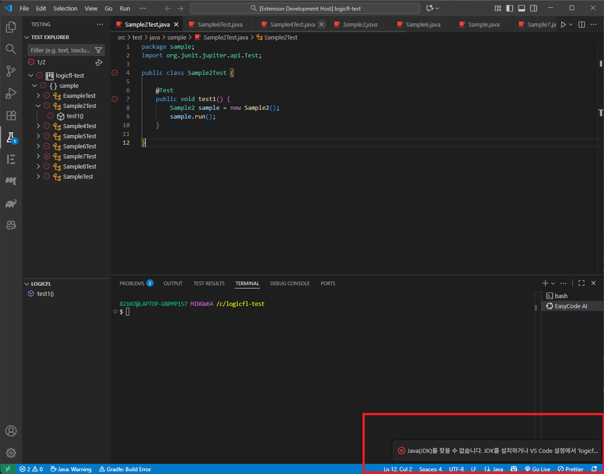
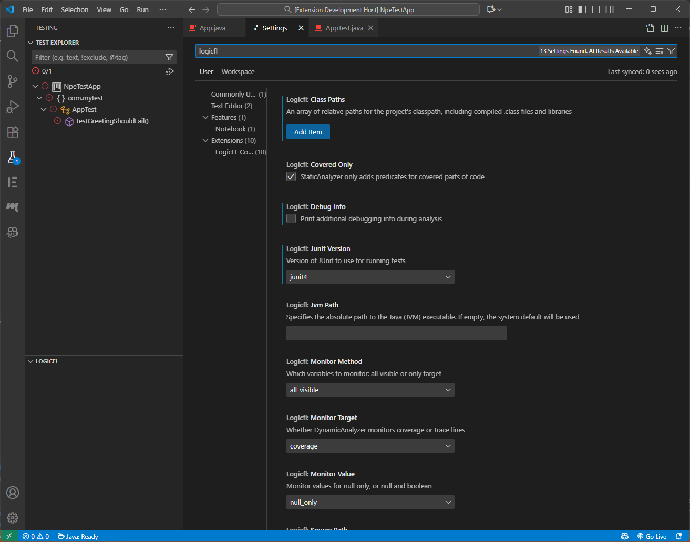

# LogicFL NPE Finder

**자바 코드의 Null Pointer Exception(NPE) 발생한 경우 이 NPE를 발생하게 한 코드상의 위치를 찾아 알려주는 VS Code 확장 프로그램입니다.**

## ✨ 핵심 기능 (Features)

- **🎯 정확한 NPE 결함 위치 식별**: 정적/동적 분석과 로직 기반 추론 기술(LogicFL)을 결합하여 NPE를 발생시킨 코드상의 근본 원인을 정확하게 찾아내고 **하이라이팅**합니다.
- **📈 NPE 전파 경로 시각화**: 결함의 원인이 되는 변수가 어떻게 전파되어 NPE를 발생시키는지 **전파 그래프(Propagation Graph)** 형태로 시각화하여 보여줍니다. 
- **🖱️ 간편한 코드 이동**: 웹뷰에 표시된 그래프의 **노드를 클릭하면 즉시 해당 코드로 이동**하여 결함 원인을 쉽게 파악할 수 있습니다.
- **🧪 VS Code 테스트 탐색기 연동**: VS Code의 Testing 탭 하단에 구현된 LogicFL view에서 NPE로 인해 **실패한 테스트 케이스를 ** 관리할 수 있으며 LogicFL 분석을 실행할 수 있습니다.

## 🚀 사용법 (How to Use)

1.  VS Code에서 분석할 자바(Java) 프로젝트를 엽니다.
2.  좌측 액티비티 바에서 **테스팅(Testing) 탭**을 엽니다.
3.  NPE로 인해 실패한 테스트 항목(**Test Item**)을 찾아 마우스 오른쪽 버튼으로 클릭합니다.
4.  컨텍스트 메뉴에서 **`Add Test For LogicFL`**을 선택하여 분석할 테스트를 LogicFL 뷰에 추가합니다.
5.  `LogicFL` 뷰에 추가된 테스트 항목 옆의 **재생(▶️) 아이콘**을 클릭하여 LogicFL 분석을 시작합니다.
6.  분석이 완료되면, 자동으로 해당 자바 파일이 열리고 **NPE 결함 위치가 하이라이팅**됩니다.
7.  동시에 별도의 웹뷰(WebView) 탭에 **NPE 전파 경로 그래프**가 나타나 결함 원인의 흐름을 파악할 수 있습니다.
   

## 🛠️ 설치 전 요구사항 (Prerequisites)

이 확장 프로그램을 사용하기 전, 아래의 프로그램들이 반드시 설치되어 있어야 합니다.

- **VS Code Extension - Java Test Runner**: VS Code 마켓플레이스에서 `Test Runner for Java` 확장이 설치되어 있어야 테스트 항목이 정상적으로 표시되고 실행됩니다.
- **Java Development Kit (JDK)**: 시스템 경로에 등록되어 있거나, 아래 `logicfl.jvmPath` 설정에서 직접 경로를 지정해야 합니다.
- **Prolog**: SWI-Prolog 등 시스템 경로에 등록된 Prolog 인터프리터.

미설치시 다음과 같은 오류 메시지가 뜹니다. 프로그램들을 설치하고 다시 실행하시기 바랍니다.

## ⚙️ 확장 프로그램 설정 (Extension Settings)

`File > Preferences > Settings` (단축키: `Ctrl + ,`) 에서 `logicfl`을 검색하여 분석 옵션을 상세하게 설정할 수 있습니다.

ℹ️ Note: 이 확장 프로그램의 기본 설정은 Gradle 프로젝트에 최적화되어 있습니다. Maven 프로젝트에서 별도의 설정 없이 자동으로 감지되어 동작하지만, logicfl.classPaths 설정을 한 번 확인해보는 것을 권장합니다.

| 설정 (Setting)              | 설명 (Description)                                                                                                                | 기본값 (Default)                   |
| :-------------------------- | :-------------------------------------------------------------------------------------------------------------------------------- | :--------------------------------- |
| **`logicfl.junitVersion`**  | 테스트 실행에 사용할 JUnit 버전을 선택합니다. **실제 프로젝트의 JUnit 버전과 반드시 일치시켜야 합니다.** (`junit4` 또는 `junit5`) | `junit5`                           |
| **`logicfl.targetPrefix`**  | 분석할 대상 클래스가 포함된 패키지의 접두사를 지정합니다.                                                                         | `""`                               |
| **`logicfl.monitorTarget`** | 동적 분석기가 라인 커버리지를 모니터링할지, 실행 트레이스를 모니터링할지 선택합니다.                                              | `coverage`                         |
| **`logicfl.monitorValue`**  | `null` 값만 모니터링할지, `null`과 `boolean` 값을 함께 모니터링할지 선택합니다.                                                   | `null_only`                        |
| **`logicfl.monitorMethod`** | 보이는 모든 변수를 모니터링할지, 대상 패키지 내 변수만 모니터링할지 선택합니다.                                                   | `all_visible`                      |
| **`logicfl.coveredOnly`**   | 정적 분석기가 테스트에 의해 커버된 코드 부분에 대해서만 분석 정보를 추가할지 여부를 결정합니다.                                   | `true`                             |
| **`logicfl.debugInfo`**     | 분석 중 추가적인 디버깅 정보를 출력할지 여부를 결정합니다.                                                                        | `true`                             |
| **`logicfl.sourcePath`**    | 분석할 자바 소스 코드의 상대 경로를 지정합니다.                                                                                   | `src/main/java`                    |
| **`logicfl.classPaths`**    | 컴파일된 `.class` 파일과 라이브러리를 포함한 프로젝트의 클래스패스 상대 경로 배열을 지정합니다.                                   | `["build/classes/java/main", ...]` |
| **`logicfl.jvmPath`**       | 사용할 Java(JVM) 실행 파일의 절대 경로를 지정합니다. 비워두면 시스템 기본값을 사용합니다.                                         | `""`                               |

